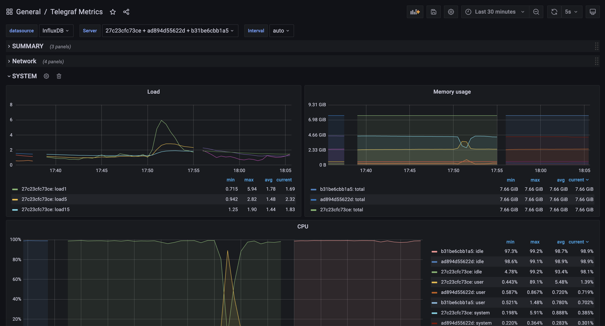
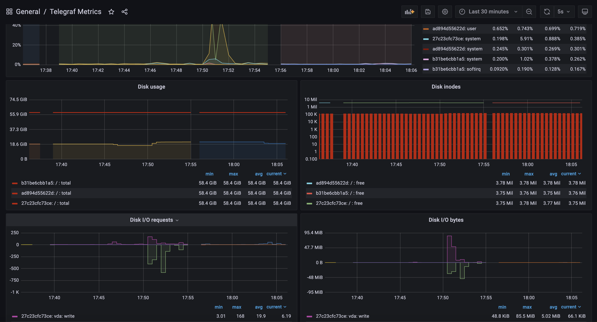
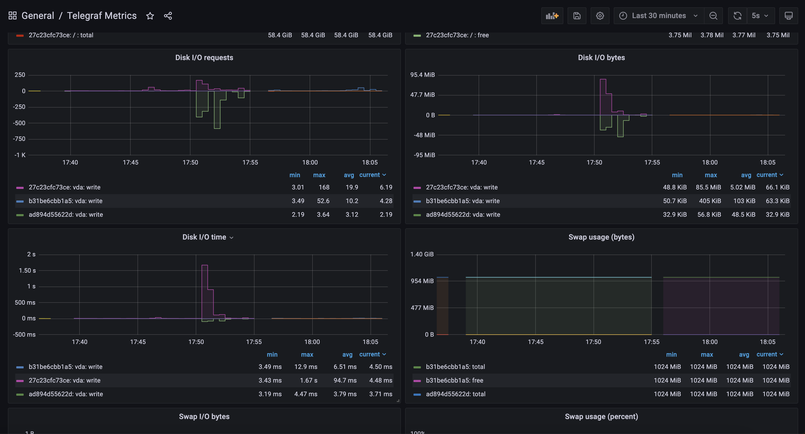
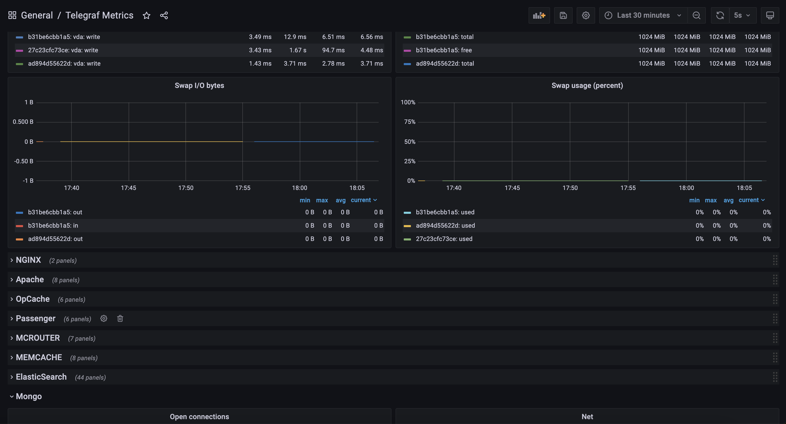
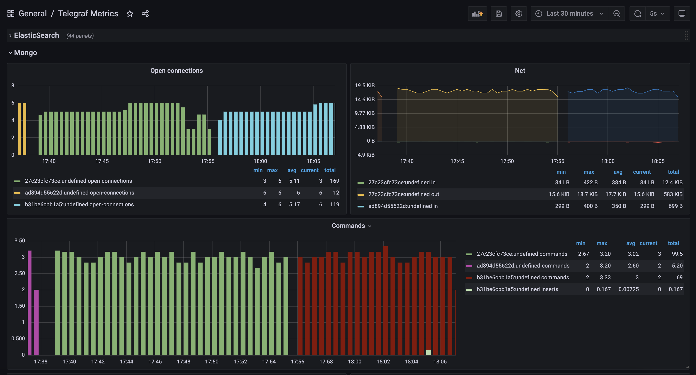

# Docker Compose project for Telegraf, InfluxDB Grafana, Rust, MongoDB

## Start the stack with docker compose

```bash
$ docker-compose up -d
```

## Screenshots of dashboards under load

### Grafana Schema
The Grafana dashboard schema used is automatically uploaded from [here](https://grafana.com/grafana/dashboards/61-telegraf-metrics) and modified according to the needs.








## Services and Ports

### Grafana
- URL: http://localhost:3000 
- User: admin 
- Password: admin 

### Telegraf
- Port: 8125 UDP (StatsD input)

### InfluxDB
- Port: 8086 (HTTP API)
- User: admin 
- Password: admin 
- Database: influx

### MongoDB
- Port: 27017
- User: root 
- Password: example 
- Database: test

### Rust App
- URL: http://localhost:8080 

## Steps to Start Testing

1. **Build and Start Docker Containers**
   ```bash
   $ docker-compose up -d
   ```

2. **Navigate to the `testing` directory**
   ```bash
   $ cd testing
   ```

3. **Start the load tester**
   ```bash
   $ ./start-containers.sh
   ```

4. **Verify load tester logs**
   - Ensure that the load tester is running correctly by checking the logs. 
   ```bash
   $ docker logs -f resource-monitoring-system-load_tester-1
   ```

5. **Check Grafana Dashboard**
   - Open your browser and navigate to [Grafana](http://localhost:3000)
   - Login with the default credentials (admin/admin)
   - Observe the dashboards for real-time metrics.


## Run the influx client:

```bash
$ docker-compose exec influxdb influx -execute 'SHOW DATABASES'
```

Run the influx interactive console:

```bash
$ docker-compose exec influxdb influx

Connected to http://localhost:8086 version 1.8.0
InfluxDB shell version: 1.8.0
>
```


## License

The MIT License (MIT). Please see [License File](LICENSE) for more information.

